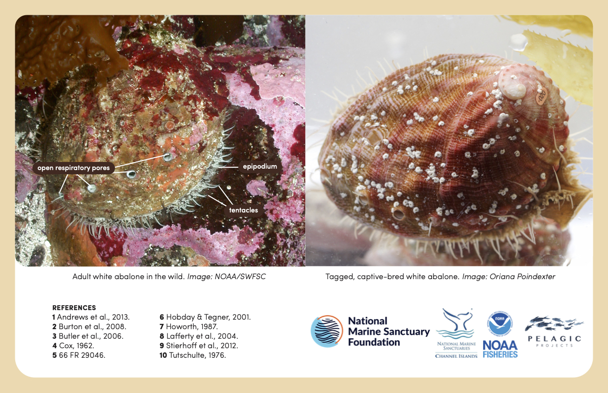
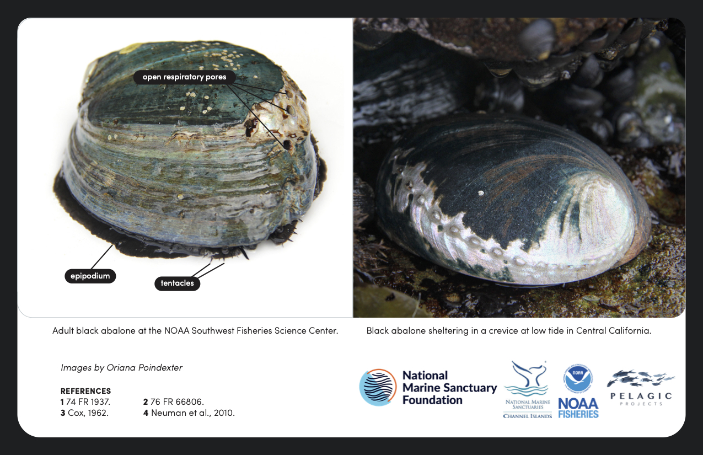

```{r setup, include=FALSE}
knitr::opts_chunk$set(echo = TRUE)
```

 <a class="btn btn-primary fa fa-question-circle"  href="glossary.html" target="_blank"> Glossary of key terms</a>
 
 
<div class="card-group">
  
  <div class="card text-center bg-light">>
    
    
     <a href="http://www.orianapoindexter.com/id-guides" class="btn btn-primary">Source: Oriana Poindexter</a>
    </div>
      <div class="card text-center bg-dark">>
    
    
     <a href="http://www.orianapoindexter.com/id-guides" class="btn btn-primary">Source: Oriana Poindexter</a>
    </div>
  
  </div>
