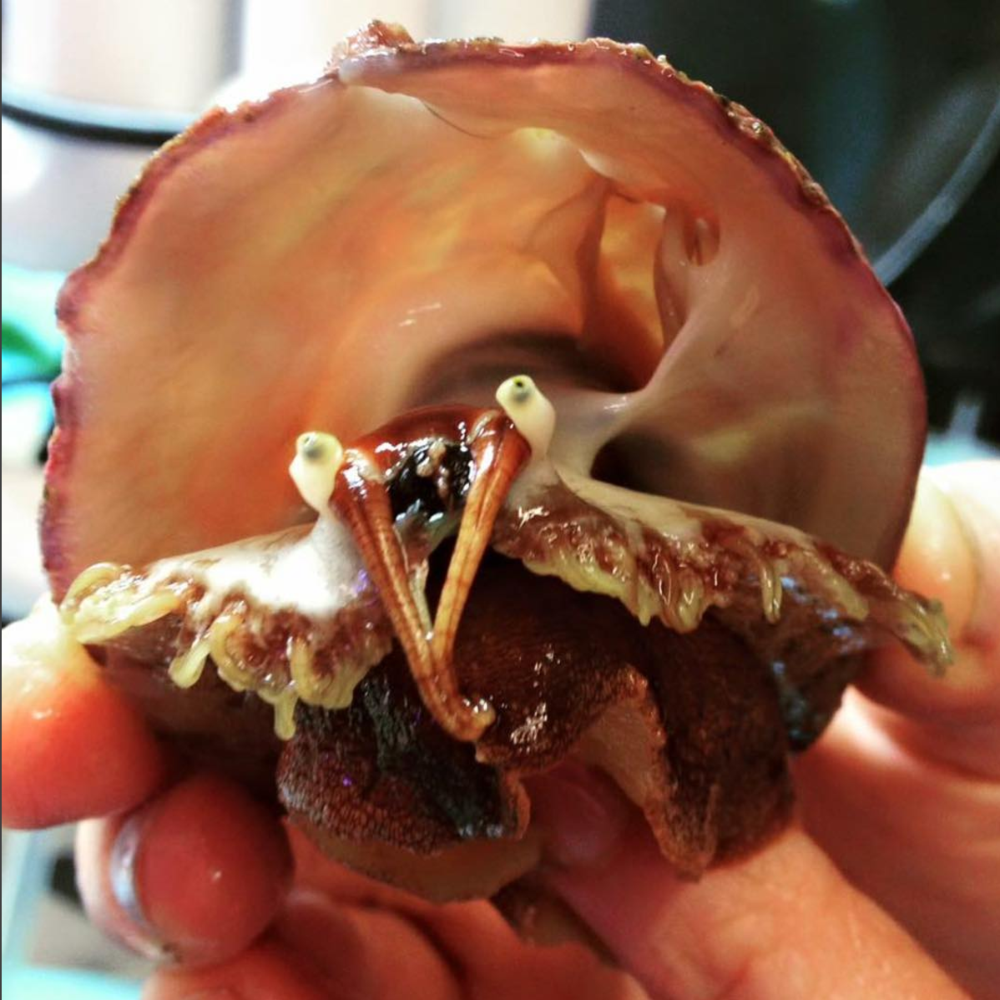

White abalone (*Haliotus sorenseni*) belongs to a group of plant-eating marine snails that were once common in California. They once numbered in the millions off the California coast, but now they are endangered. In 2001 white abalone became the first ever marine invertebrate to be Listed as endangered under the [Endangered Species Act](https://www.fisheries.noaa.gov/topic/laws-policies#endangered-species-act). White abalone are one of [NOAA Fisheries' Species in the Spotlight](https://www.fisheries.noaa.gov/species/white-abalone/spotlight)—an initiative that includes animals considered most at risk for extinction and prioritizes their recovery efforts. Source: [NOAA Fisheries](https://www.fisheries.noaa.gov/species/white-abalone#overview)

{width=50%}
