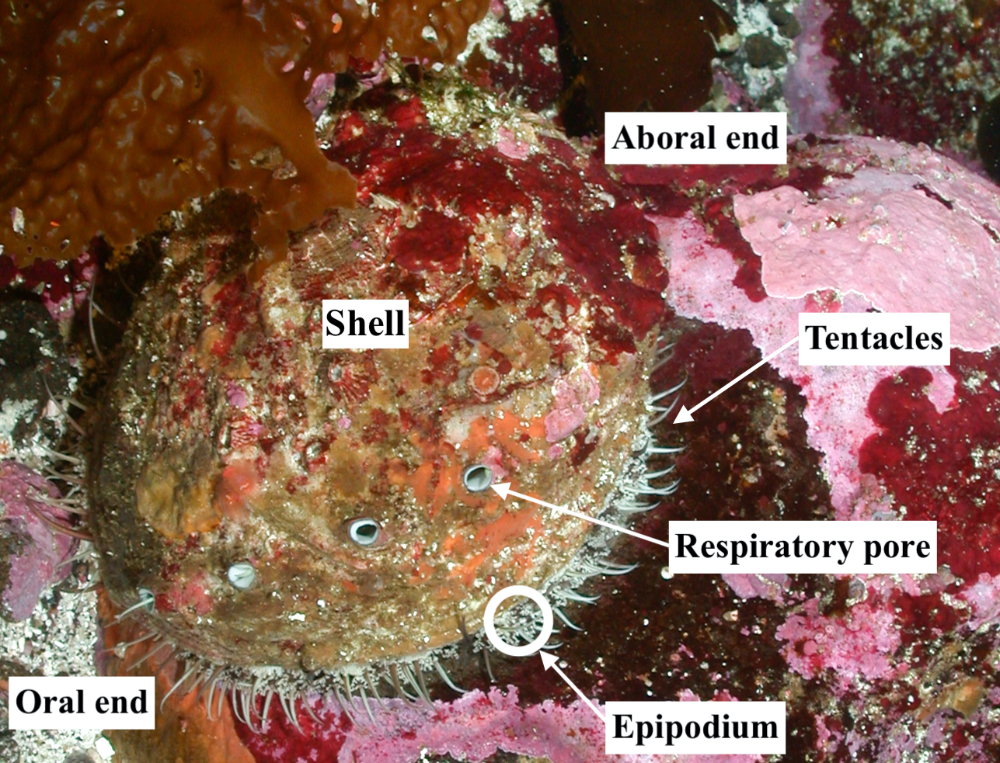

## Key terminology

**Abalone**: Abalone is a common name for any of a group of small to very large marine gastropod mollusks in the family Haliotidae

**Gastropod**: "gastro" = stomach, "pod" = foot; gastropods (commonly known as snails and slugs) belong to a large taxonomic class of invertebrates within the phylum Molluska called Gastropoda.

## Abalone anatomy
**Oral**: relating to the mouth (referring to the "mouth end")

**Aboral**: relating to/denoting the side or end that is furthest from the mouth

**Tentacle**: a slender, flexible limb or appendage in an animal, especially around the mouth of an invertebrate, used for grasping or moving about, or bearing sense organs.

**Epipodial**: "epi" = around, "podial" = relating to the foot; one of the lateral lobes of the foot of an abalone 

**Respiratory pore**: aka "breathing pore", an opening of the external body anatomy (visible in the shell of an abalone) which draws in water, allowing the organism to breath 

