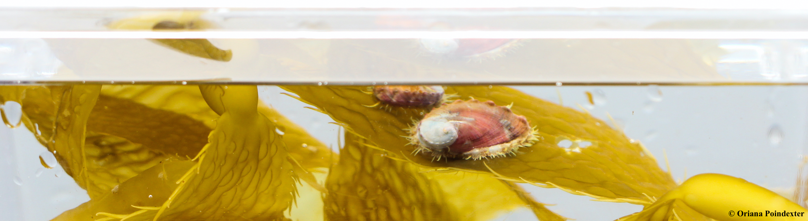

### Calling all divers!

We need your help to **find HAL**, endangered
white abalone in the genus "*Haliotis*" in and around the Southern California Bight (Point Conception to Ensenada).

White abalone (*Haliotis sorenseni*) are on the brink of extinction, **your** observations could contribute to the conservation of this endangered species.

Use our [ID cards](cards.html) to see different abalone species, and help us positively ID white abalone. 

Going diving? Be sure to visit our [Resources](resources.html) page for more SCUBA-related abalone ID and best practices. Want to learn more about these marine snails? Visit our [About](about.html) page for more information, or visit NOAA Fisheries to find out [why you should care about white abalone](https://www.fisheries.noaa.gov/feature-story/white-abalone-why-you-should-care-about-critter). 

### Already gone diving? {#submit}

Please submit your abalone field observation here: 
<a
class="btn btn-primary fa fa-paper-plane"
href="https://forms.gle/QHMorg3k1w9QU4CH8" target="_blank"> Submit an observation</a>

*Note: No information will be shared publicly; media will only be used to identify white abalone.*

{width=75%}

As part of the *Wanted Alive! White Abalone* campaign, Finding Hal sponsored and funded by the [National Marine Sanctuary Foundation](https://marinesanctuary.org/), implemented through [Ecoquants](https://ecoquants.com/). Partners involved with the campaign (but not hosting this web portal) include the [NOAA Channel Islands National Marine Sanctuary](http://channelislands.noaa.gov/) and [NOAA Fisheries Office of Protected Resources](https://www.fisheries.noaa.gov/about/office-protected-resources).