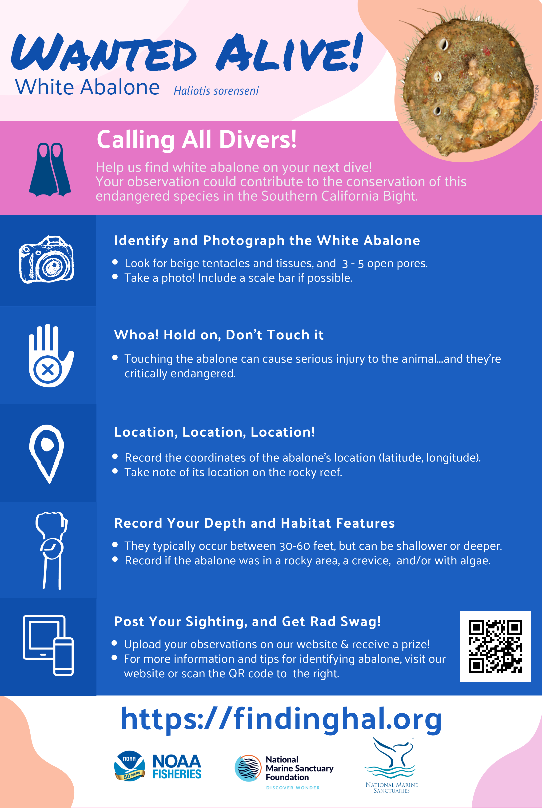
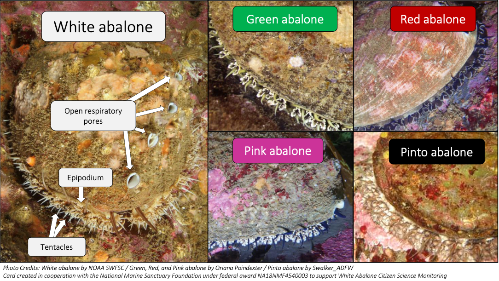

```{r setup, include=FALSE}
knitr::opts_chunk$set(echo = TRUE)
```

```{r load_packages, message=FALSE, warning=FALSE, include=FALSE} 
library(fontawesome)
```

# `r fa(name = "swimmer")`<span style='color:#000000; font-size:75%'> Going diving? </span>
Here's how you can help positively ID white abalone!

`r fa(name = "hand-point-down")` Click on the dropdown below to navigate to different resources 

## {.tabset .tabset-dropdown}

### Wanted Alive Poster



### Abalone Comparative ID Card

 


- [Click here to access the comperative field ID card](./images/Abalone-id-cards_5x8.pdf){target="_blank"}

### Habitat Characterization Data Sheet

**Habitat Characterization Data Sheet** – Each dive team completes a habitat data sheet (see below) topside, after the dive team exits the water. It is not necessary for the data sheet to be carried by the divers during the dive. The purpose of this data sheet is to provide a *qualitative* characterization of some of the more important features of the habitat. The habitat data sheet references the scoring protocols for each of the categories: algae, invertebrates, relief, substrate, rock type, and quality of abalone habitat. The last of these is a subjective assessment based on the experience of the diver. Empty shells seen during the dive should be noted on this data sheet as well. 

**Please upload your completed habit characterization data sheet along with your [abalone field observation](https://forms.gle/7ES7mD9mbVvvCtKX9){target="_blank"}** 

- [Click here to download the habitat characterization data sheet](./files/Habitat_data_sheet.pdf){target="_blank"}
