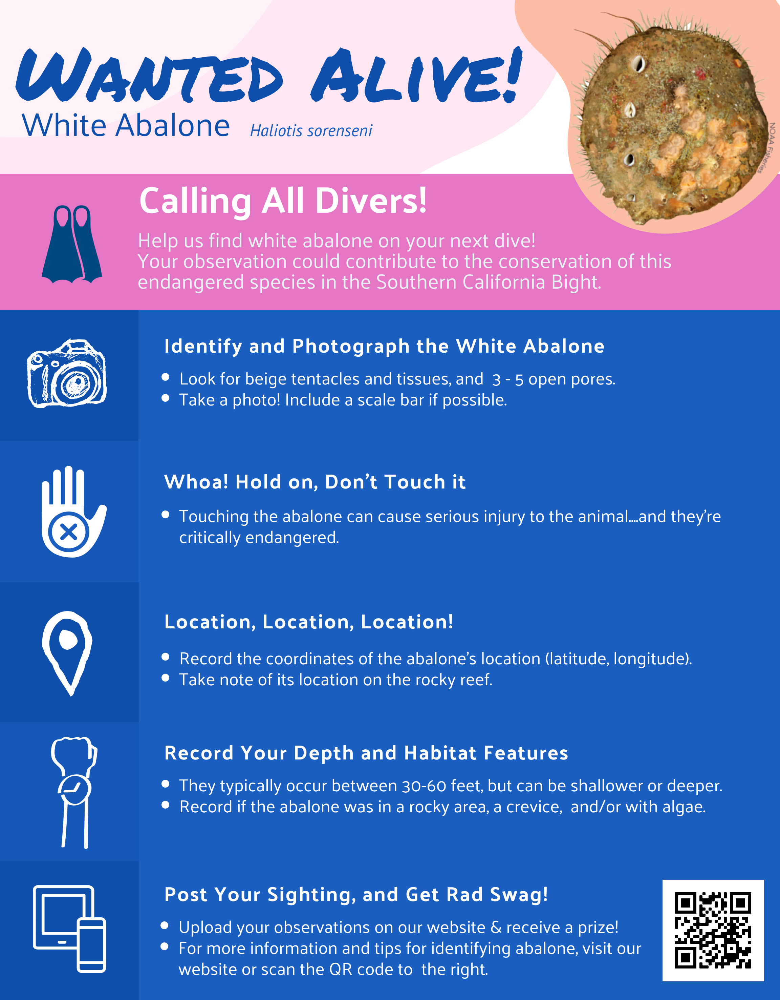

```{r setup, include=FALSE}
knitr::opts_chunk$set(echo = TRUE)
```

```{r load_packages, message=FALSE, warning=FALSE, include=FALSE} 
library(fontawesome)
```

# `r fa(name = "swimmer")`<span style='color:#000000; font-size:75%'> Going diving? </span>
Here's how you can help positively ID white abalone!

## {.tabset}

### Wanted Alive Poster {#poster}


### SCUBA-Related Resources {#diveresources}

 


- [Click here to access the comperative field ID card](./images/Abalone-id-cards_5x8.pdf){target="_blank"}

