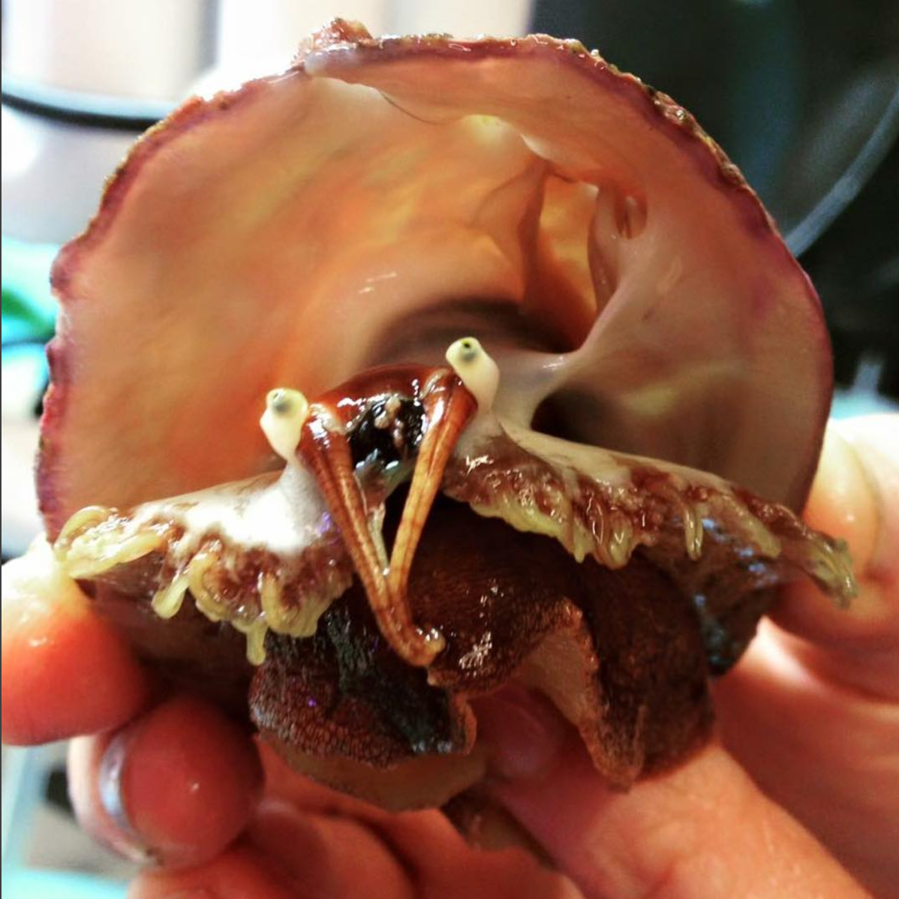

```{r setup, include=FALSE}
knitr::opts_chunk$set(echo = TRUE)
```

Please share your observation of white abalone by filling out the:

<a class="btn btn-primary" href="https://forms.gle/7ES7mD9mbVvvCtKX9" target="_blank">Submit survey</a>

Thank you for participating!

